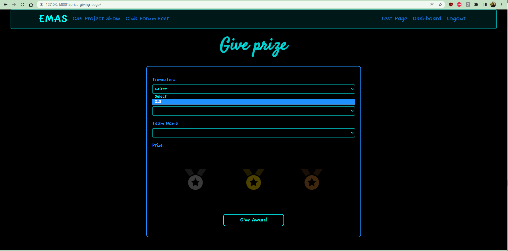
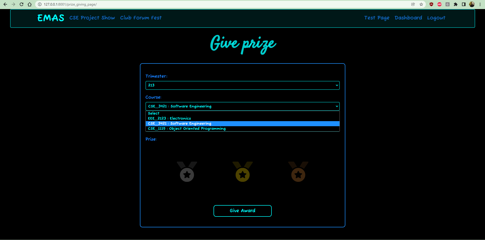
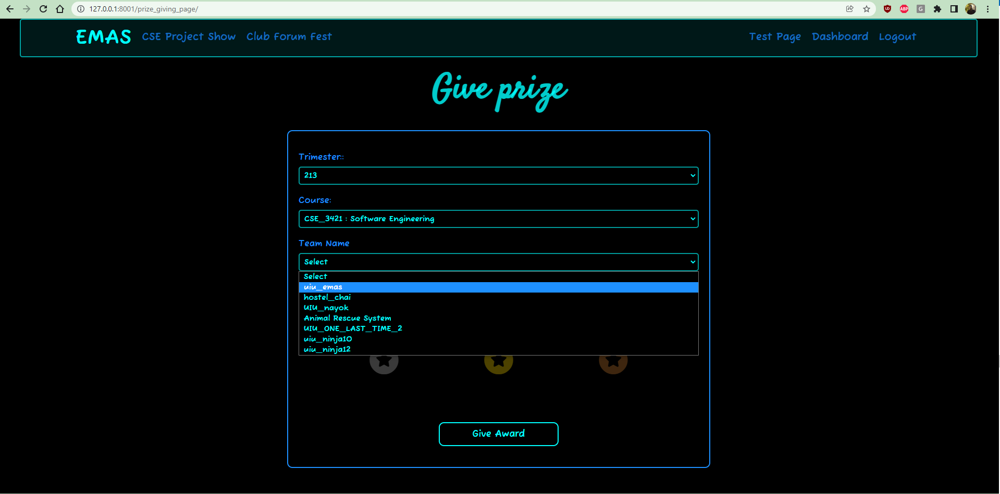
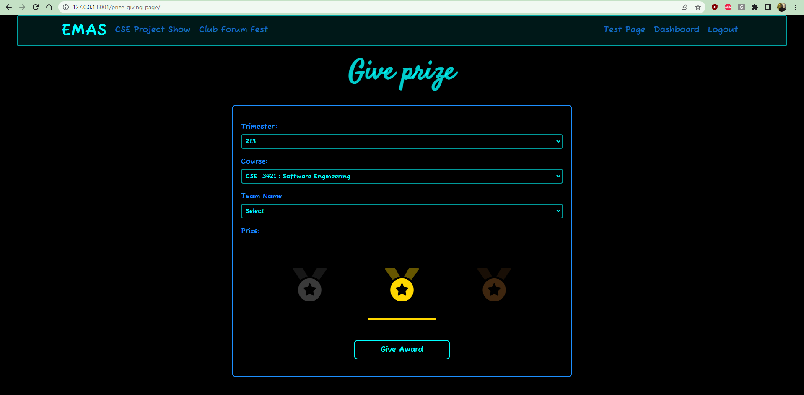
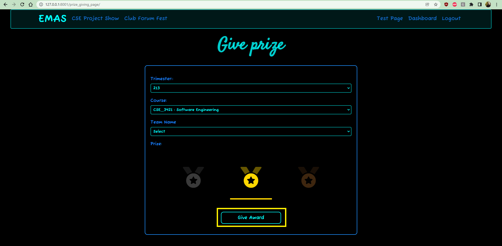

#Giving awards
To give an award you need to access the **Prize Giving Page**. You must logged in an admin account to access this page. The page can be accessed through the [Admin Dashboard](). Here are the steps to award a prize to a team:

1. Select a trimester from the **`Trimester`** dropdown menu.

2. Select a course from the **`Course`** dropdown menu.

3. Select a team from the **`Team Name`** dropdown menu.

4. Click on an award to give.

5. Finally, press **`Give Award`**.

