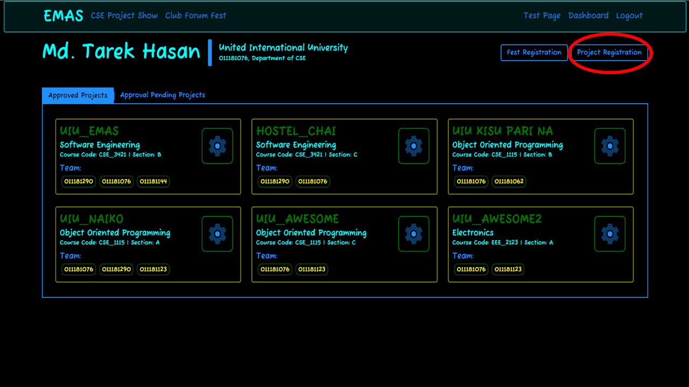
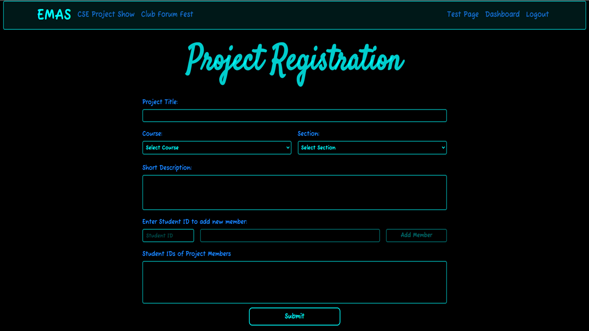
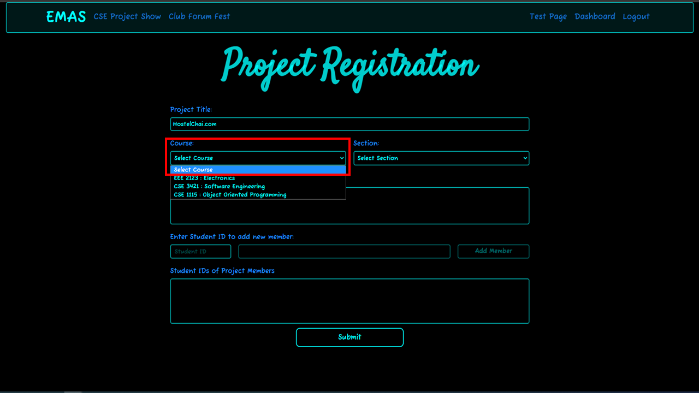
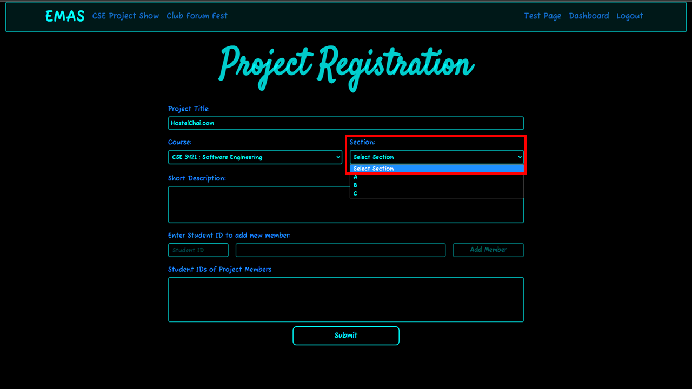
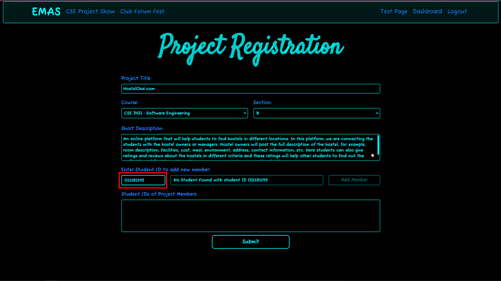
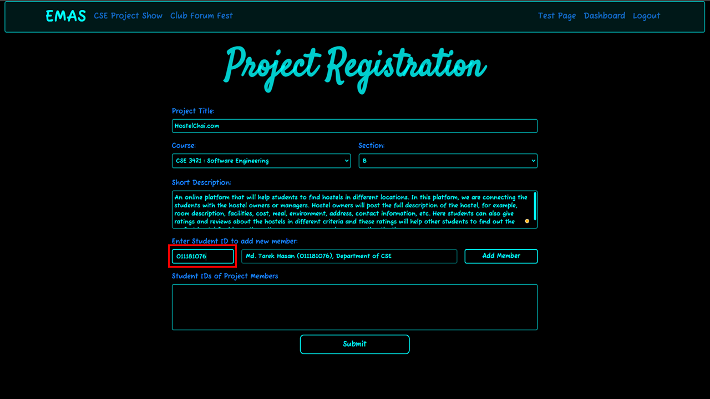
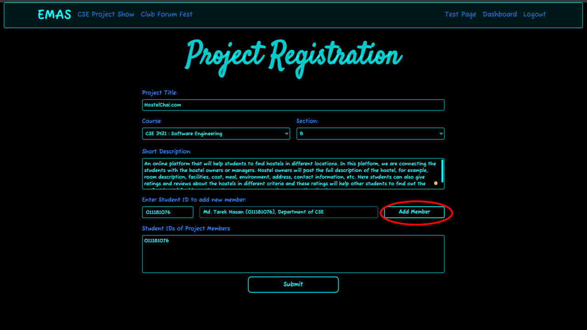
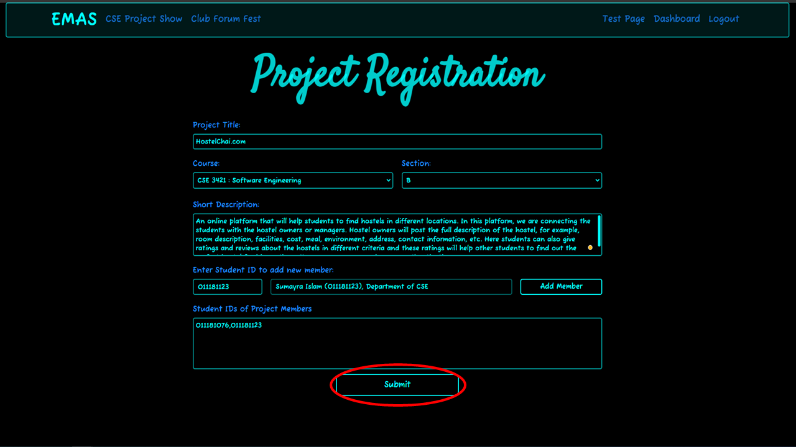
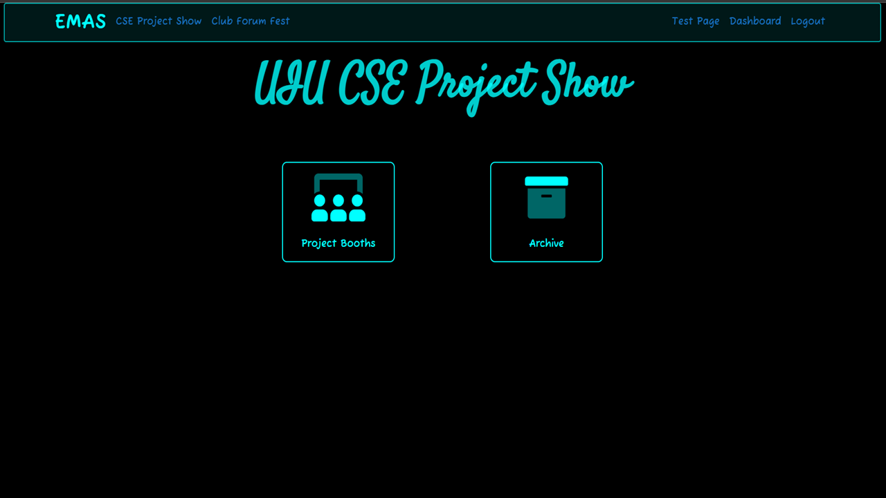

# Project Registration

For registering your project for the CSE project show, you must have to be an **authenticated student**. Let's go step by step.

## Student Dashboard
* By clicking the `button` in the top right corner shown in the picture, you'll be able to reach the *Project Registration Page*

## Project Registration Page
* After reaching the *Project Registration Page*, you'll get a `form` for registration.

* After filling up the **project title**, you need to **select course** from the `Dropdown Menu`.

* Then you need to **select section** of that particular course from another `Dropdown Menu` shown in the picture.

* After filling up the **short description** of the project, now it's time to add **team members**. To add your team members you need to write his/her ***student ID*** in the `textbox` which is shown in the picture. If the student is **not registered** in UIU EMAS using his/her ***student ID***, then you'll see a `message` saying that no student was found with that particular ID as shown in the picture.

* If you enter the ***student ID*** of a **registered** student, then you'll see the information of the student bearing that ***student ID***. Moreover, the `Add Member` button will be enabled.

* By clicking on the `Add Member` button which is shown in the picture, you can add member to your project.

* By following the **same procedures**, you can add multiple members to your project.
* Finally, you need to submit the form by using the `Submit` button shown in the picture.

* Now, you'll be redirected to the homepage of *CSE project show*.

    <!-- mkdocs.yml    # The configuration file.
    docs/
        index.md  # The documentation homepage.
        ...       # Other markdown pages, images and other files. -->
