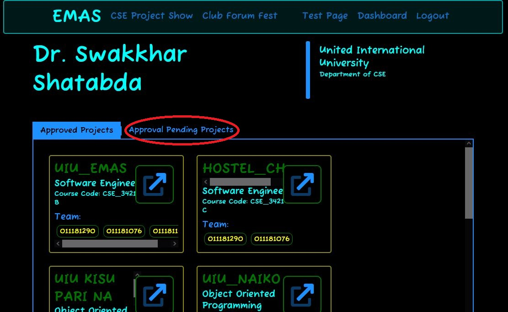
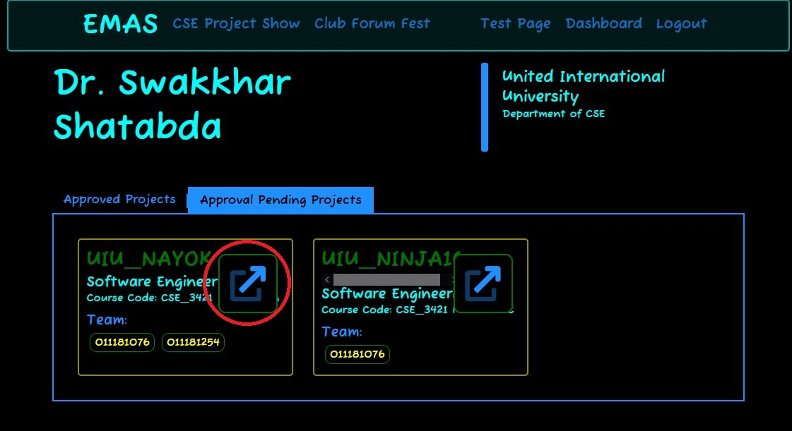
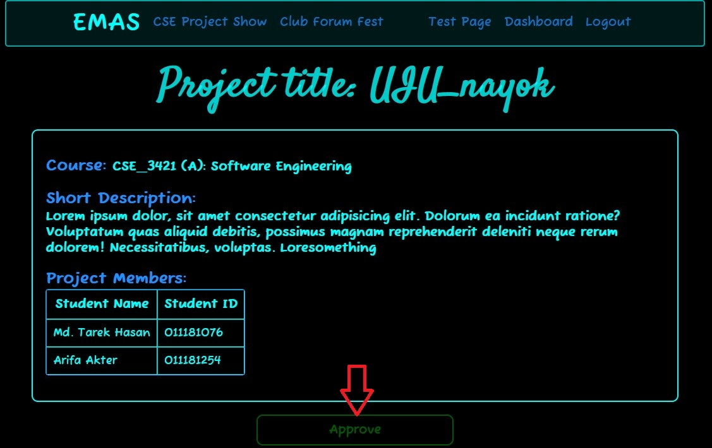
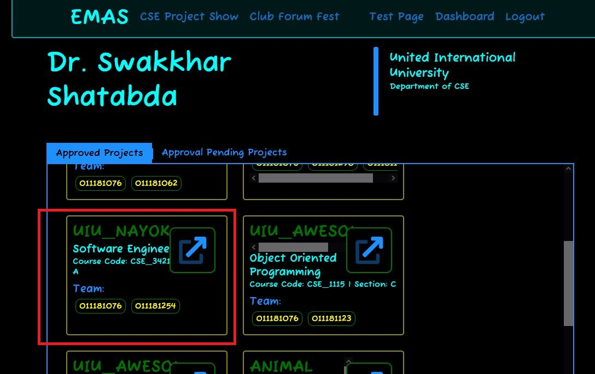

# Project Approval

To **Approve the Projects**, teacher must login first then he/she can able to see the *pending projects* and *approved projects* in his/her ***Dashboard***.

## Teacher Dashboard
  Here is the **Teacher Dashboard page** . To approve the projects, click on the *Approval Pending Projects* which is shown in the picture.
  

  After clicking on the *Approval Pending Projects*, then pending projects will be shown. To see the projects full description click on the `button` which is marked by red circle in the following picture.
  

## Project Approval Page

  * After clicking on the `button`, the full description of the projects will be shown in a page.
  * At the bottom of that page, there is an **Approve** `button`.
  * To *approve* the project click on the **Approve** `button`.
    

  * After approving the Project, it will redirect to **Teacher Dashboard page**. Now the project that  has been *approved* just now will be shown in the *approved projects*.
    
