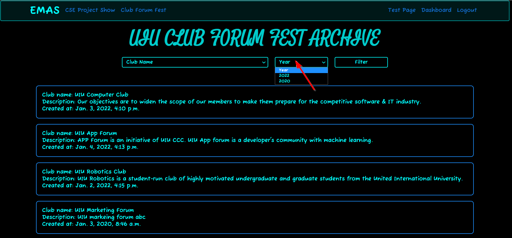

# Club Forum Fest Booth Archive 

You will be able to view all the available `Club Forum Fest Booth`. You can use `Club Name` or `Year` or `Both` to filter the booths. Let's go step by step:

*  Visit [EMAS](http://127.0.0.1:8000/) home page.

## Club Forum Fest Booth Archive: Without Filter

*  Click on `Club Forum Fest` button.

*  Click on `Archive` button.

*  You will be shown all the available booths `till date`.

## Club Forum Fest Booth Archive: Filter by Club Name 

*  Select a `Club name` to filter with.

*  Click on the `Filter` button.

*  All the available booths will be shown filtered with the specific `Club name` (here club name is UIU Computer Club).

## Club Forum Fest Booth Archive: Filter by Year

*  Select a `Year` to filter with.

*  Click on the `Filter` button.

*  All the available booths will be shown filtered with the specific `Year` (here Year is 2022).

## Club Forum Fest Booth Archive: By Club Name and Year

*  Select a `Club name` (here club name is UIU Computer Club) to filter with.
*  Select a `Year` (here year is 2022) to filter with.

*  Click on the `Filter` button.

