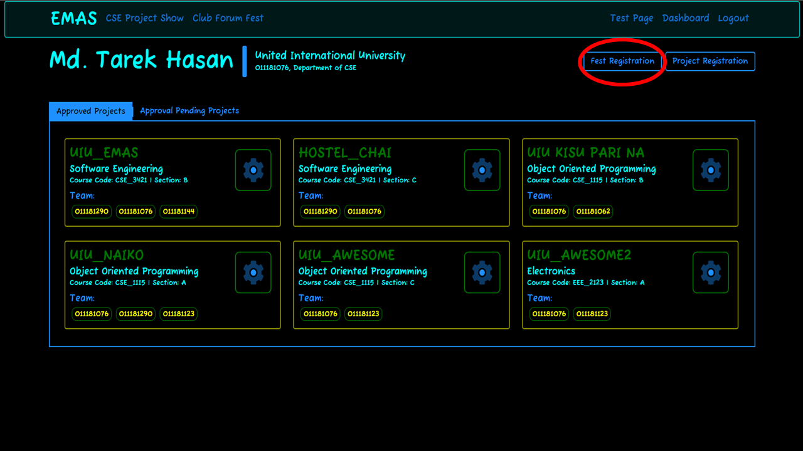
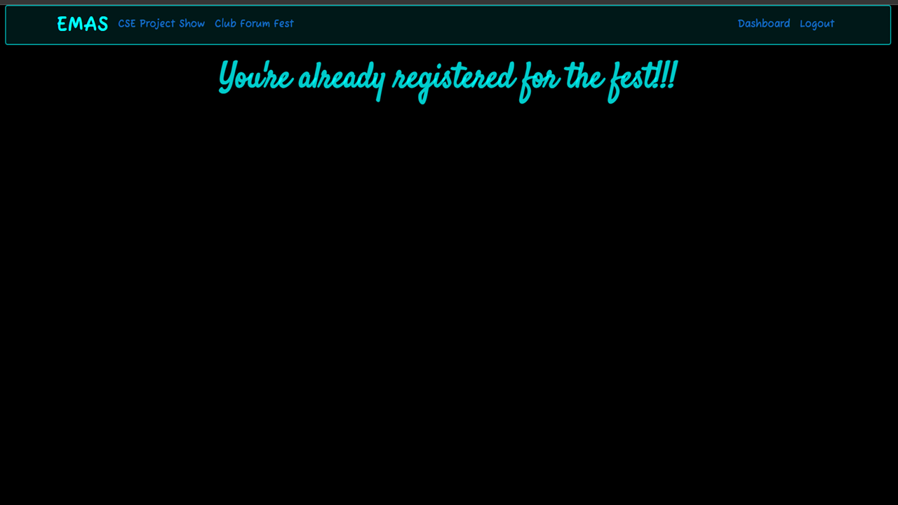
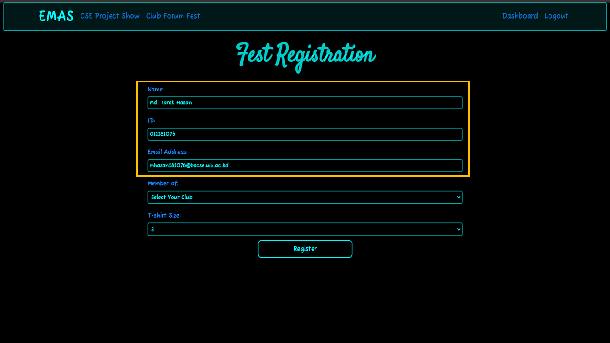
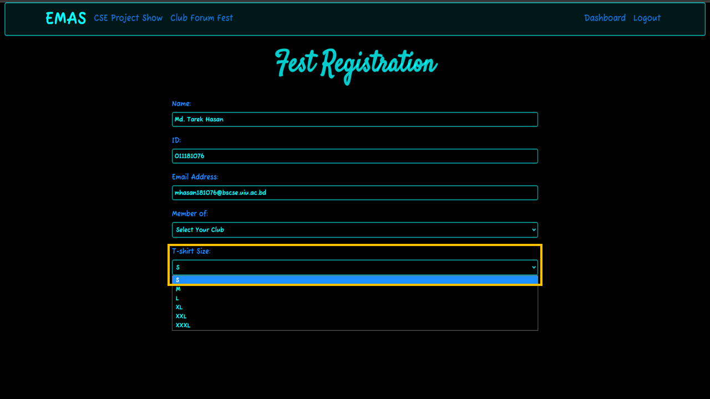
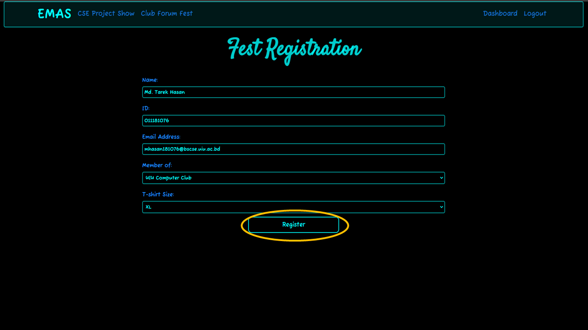
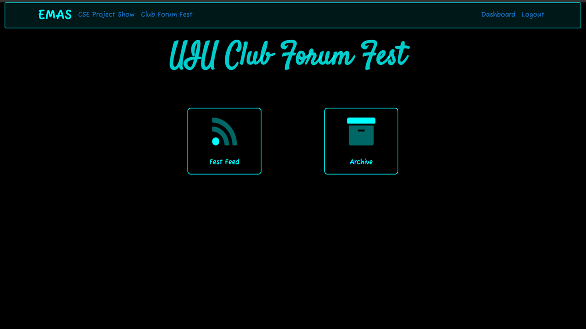

# Fest Registration

To register for the UIU Club-Forum Fest, you have to be an **authenticated student**. Let's go step by step.

## Student Dashboard
* By clicking the `Fest Registration` button in the top right corner shown in the picture, you'll be able to reach the *Fest Registration Page* if you're not already registered.

## Fest Registration Page
* If you're already registered for the UIU Club-Forum Fest, then you'll see the page as shown in the picture below. Otherwise, you'll be redirected to the *Fest Registration Page*.

* After reaching the *Fest Registration Page*, you'll get a `form` for registration as shown in the picture below. Moreover, you'll see the **basic information** about yourself for confirmation. If you want to **update** your information, you need to contact the system admin.

* You need to **Select Your Club** from the `Dropdown Menu` as shown in the picture.

* After that you need to **Select Your T-shirt Size** from another `Dropdown Menu` which is shown in the picture where the default size of T-shirt is S.
    - S : Small
    - M : Medium
    - L : Large
    - XL : Extra Large
    - XXL : Extra Extra Large
    - XXXL : Extra Extra Extra Large

* Finally, you need to submit the form by using the `Register` button shown in the picture.

* Now, you'll be redirected to the homepage of ***UIU Club-Forum Fest***.

