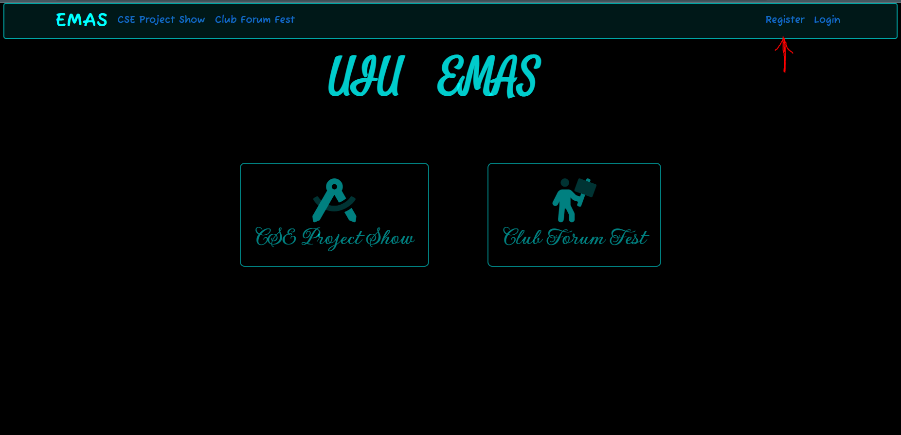
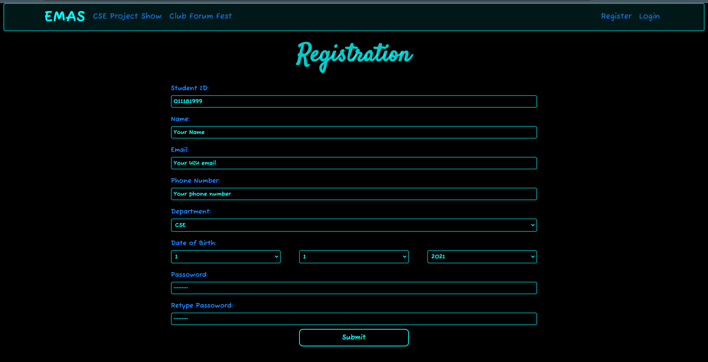
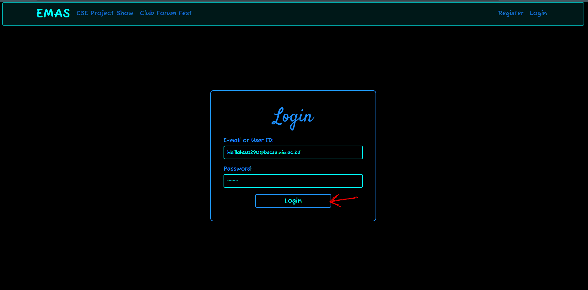
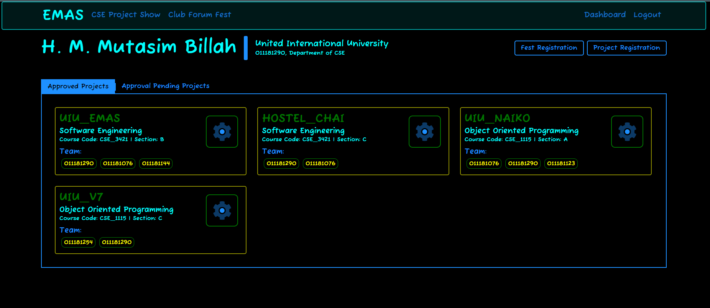
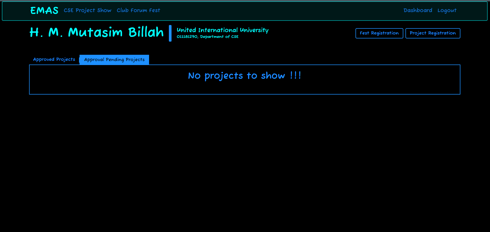
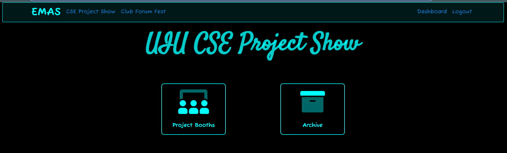
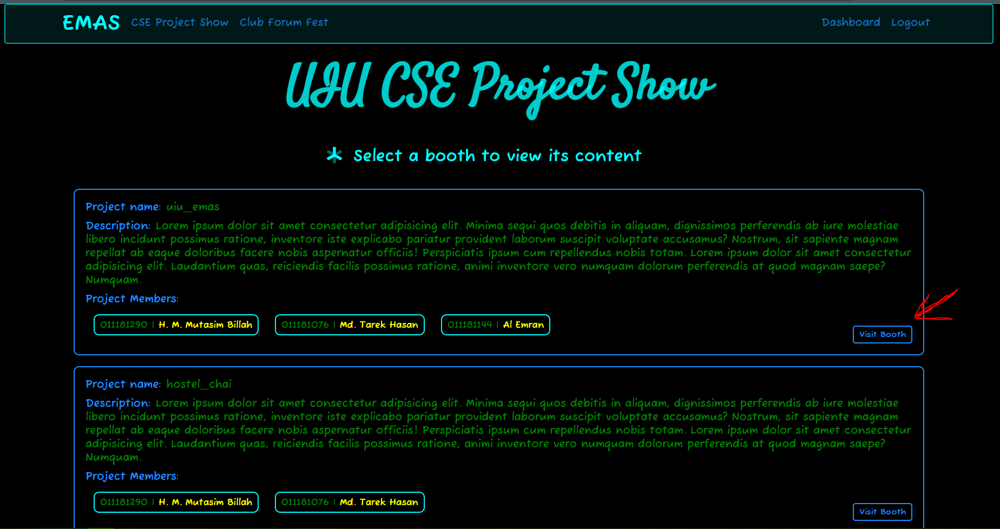
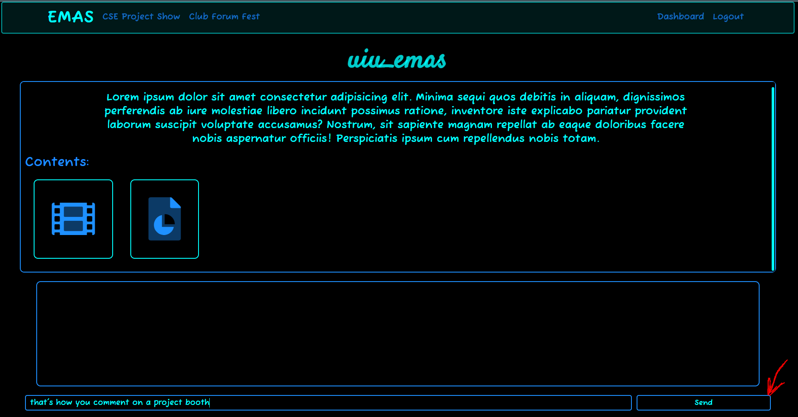

# Visiting a CSE Project Booth
For commenting in project booth you must have to be an **authenticated user**. Let's go step by step.

## Registering as a student

* Goto [EMAS](http://127.0.0.1:8080/) home page
* Click on `Register`. 

* Fill up the **registration form**. 

* Click on **`Submit`**. 

## Login

* If registration goes well you'll be redirected to [Login page](http://127.0.0.1:8080/general/login_page/).
* Then put your Student ID or E-mail and Password.
* Click on **`Login`** 

* You'll be redirected to your dashboard if you put your credentials properly

## Dashboard

* In dashboard you'll be able to see the projects you are assigned in. 

* from your dashboard you can register for UIU Club Forum Fest by clicking **`Fest Registration`** 
and also you register a new project by clicking on **`Project Registration`**
* In dashboard you can see 2 tabs one is **`Approved Projects`** and the other one is **`Approval Pending Projects`**
* In **`Approved Projects`** tab you can see the projects which are approved for **CSE Project Show**.
* And by clicking on **`Approval Pending Projects`** you can see the projects which are not approved yet.
* As you can see in the following image. The user H.M. Mutasim Billah has no projects which are pending .for approval.

## Project Booth Explorer

* Click on [**`CSE Project Show`**](http://127.0.0.1:8080/cse_ps/index/) form the navbar. You wil see a page like follwing

* Click on **`Project Booth`**.
* You will be able see the courses and the project count for the course.
* Select a course then you will see the list of all project of that course.
* Click on **`Visit Booth`**. 

## Commenting

* You will see the contents of that project and a comment box with a placeholder like **comment anything ...**.
* write something on that comment box and click on **`Send`** or hit **`Enter`**. 

* So. that's how you make comment on a project booth.
* You can also watch the demo video by clicking on the film icon in the contents section 
or you can download the project report form there.